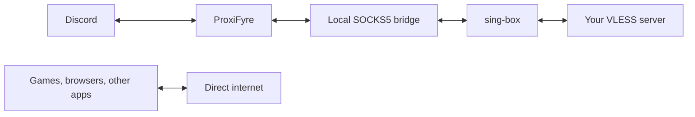

<div align="center">
  

  # DisRoute

  **Discord-only VLESS routing for Windows — without sending the rest of the system through a VPN.**

  [](https://github.com/AlirezaZexter/disroute/actions/workflows/ci.yml)
  [](https://github.com/AlirezaZexter/disroute/releases/latest)
  [](https://github.com/AlirezaZexter/disroute/releases)
  [](LICENSE)

  [Download](https://github.com/AlirezaZexter/disroute/releases) · [راهنمای فارسی](docs/START-HERE-FA.txt) · [Troubleshooting](docs/TROUBLESHOOTING.md) · [Contributing](CONTRIBUTING.md)
</div>

> [!IMPORTANT]
> DisRoute is an unsigned preview. It improves routing convenience; it is not a privacy, anonymity, or leak-prevention product.

## Why DisRoute?

Some networks cannot reach Discord reliably, while routing the whole computer through a VPN adds latency to games, browsers, and downloads. DisRoute targets the Discord desktop processes only and keeps unrelated applications on the normal network path.

- Per-process TCP and UDP routing for Discord Stable, PTB, and Canary
- VLESS links with Reality, TLS, TCP, WebSocket, HTTP, and gRPC transports
- XUDP and `packetaddr` selection from compatible VLESS share links
- Remote DNS recovery for Discord and dynamic voice hosts
- Windows-protected profile storage with explicit save and delete controls
- Persian RTL interface, tray lifecycle, keyboard access, and reduced-motion support
- Portable, versioned Windows builds with pinned and SHA256-verified engines

## Quick start

1. Open [Releases](https://github.com/AlirezaZexter/disroute/releases) and download `DisRoute-<version>-windows-x64.zip` — not GitHub's source archive.
2. Extract the ZIP completely.
3. Run the included ProxiFyre prerequisite installer once.
4. Start `DisRoute.exe` as Administrator.
5. Paste your own VLESS share link and connect.

The package includes a Persian text guide. WebView2, the Microsoft Visual C++ x64 runtime, and Windows Packet Filter are required.

## How it works



The Tauri/Rust controller owns the local engine lifecycle. ProxiFyre performs Windows per-process interception, the loopback bridge recovers validated Discord voice SNI without decrypting TLS, and sing-box carries the resulting TCP/UDP traffic through the configured VLESS outbound.

## Voice and streaming

DisRoute does not cap upload bandwidth. Discord media uses UDP when available, and the UDP relay bypasses the TCP/SNI inspection path inside DisRoute. Actual stream quality still depends on:

- the VLESS server's upstream capacity, distance, packet loss, and UDP support;
- whether the server supports the share link's XUDP or `packetaddr` mode;
- TCP head-of-line blocking when UDP is encapsulated through a TCP-based VLESS transport;
- other applications competing for the same physical upload connection.

If calls connect but streams stall or pixelate, read [Voice and streaming troubleshooting](docs/TROUBLESHOOTING.md#voice-and-streaming). A successful HTTPS probe does not prove media quality.

## Supported links

DisRoute accepts `vless://` links and validates the UUID, server, port, security mode, transport, and certificate settings before startup. Certificate verification cannot be disabled through the UI.

| Feature | Supported values |
| --- | --- |
| Security | `none`, `tls`, `reality` |
| Transport | `tcp` / `raw`, `ws`, `http`, `grpc` |
| Flow | `xtls-rprx-vision` |
| UDP packet encoding | `xudp`, `packetaddr`, disabled (`none`) |

Unknown transport, flow, security, and packet-encoding values fail closed with a readable error.

## Security boundaries

- Generated process rules match Discord executables and Discord's own updater path; games and browsers are not added.
- Saved profiles use Windows DPAPI and are bound to the current Windows account.
- The active sing-box configuration is temporarily written under the app's local AppData runtime directory and removed during normal shutdown.
- Releases are currently unsigned previews. Verify the release checksum before use.
- A local Administrator or malware running as the same user can still access runtime state and traffic.
- Routing separation cannot reserve bandwidth or prevent unrelated apps from saturating the connection.

See [SECURITY.md](SECURITY.md) for reporting guidance and [VOICE_ROUTING.md](VOICE_ROUTING.md) for the voice-host recovery design.

## Development

Requirements: Node.js 24+, Rust MSVC, Microsoft C++ Build Tools, and WebView2.

```powershell
npm ci
npm run check
npm run tauri dev
```

Build the production executable with Tauri's custom protocol enabled:

```powershell
npm run build:portable
```

Do not substitute a plain `cargo build --release`; that leaves the Tauri development URL in the executable. Engine payloads are intentionally not committed. See [the release checklist](docs/RELEASING.md) for packaging and verification.

## Repository guide

| Path | Purpose |
| --- | --- |
| `src/` | React/TypeScript desktop interface |
| `src-tauri/src/` | Rust controller, profile protection, routing configuration, and voice bridge |
| `scripts/` | Reproducible packaging and dependency verification |
| `.github/workflows/` | Windows CI and tagged prerelease builds |
| `docs/` | Setup, release, and troubleshooting documentation |

## Contributing

Issues and focused pull requests are welcome. Never attach a real VLESS link, unredacted engine configuration, packet capture, or user log. Start with [CONTRIBUTING.md](CONTRIBUTING.md) and the available issue templates.

## License

DisRoute is licensed under [AGPL-3.0-or-later](LICENSE). Bundled third-party components retain their own licenses and notices.

<div align="center"><sub>Created by Zexter · Independent of Discord Inc.</sub></div>
