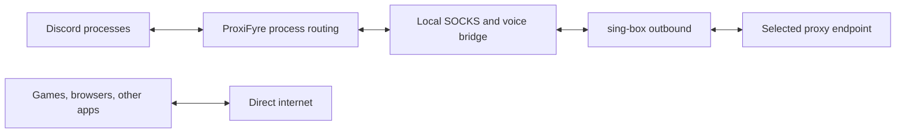

<div align="center">
  

  # DisRoute

  **Selective Discord proxy routing for Windows**

  Route Discord through a personal or community proxy while games, browsers, downloads, and the rest of Windows keep using the normal connection.

  [](https://github.com/AlirezaZexter/disroute/actions/workflows/ci.yml)
  [](https://github.com/AlirezaZexter/disroute/releases/latest)
  [](https://github.com/AlirezaZexter/disroute/releases/latest)
  [](LICENSE)

  [Download latest release](https://github.com/AlirezaZexter/disroute/releases/latest) · [راهنمای فارسی](docs/START-HERE-FA.txt) · [Troubleshooting](docs/TROUBLESHOOTING.md) · [Contributing](CONTRIBUTING.md)
</div>

> [!IMPORTANT]
> DisRoute is a preview. In-app updates are cryptographically signed, but the Windows installer is not yet Authenticode-signed and may trigger SmartScreen. DisRoute is not an anonymity, privacy, or leak-prevention product.

## What it solves

A system-wide VPN can add latency to games and redirect unrelated traffic. DisRoute applies Windows per-process routing rules to Discord Stable, PTB, and Canary instead. It does not enable the Windows system proxy, replace the system DNS configuration, or create a default VPN route.

Two connection modes are available:

- **Personal configuration:** import a VLESS, VMess, Trojan, or Shadowsocks share link and optionally keep it encrypted with Windows DPAPI.
- **Community Quick Connect:** refresh permitted public subscription sources, reject invalid or unsafe entries, run real tunneled health checks, rank the working candidates, and connect to a current best option.

Community endpoints are operated by third parties. DisRoute does not own them and cannot guarantee their availability, speed, privacy, or Discord Voice quality.

## Install on Windows

1. Open the [latest release](https://github.com/AlirezaZexter/disroute/releases/latest).
2. Download `DisRoute-<version>-windows-x64-setup.exe`. Do not download GitHub's **Source code** archives.
3. Install DisRoute, then launch it with **Run as administrator**. Administrator access is required for the existing per-process packet-routing and Firewall rules.
4. If DisRoute reports that Windows Packet Filter is missing, download the portable ZIP from the same release, extract it, and run `ProxiFyre-2.6.1-win-x64-setup.exe` once. The driver prerequisite is not installed silently by DisRoute.
5. Import a personal link or open **اتصال سریع رایگان**, read and accept the third-party warning, then connect.

The setup package already contains DisRoute, ProxiFyre, and sing-box. Microsoft Edge WebView2 Runtime, Microsoft Visual C++ Runtime x64, and Windows Packet Filter must also be available on the computer.

| Release asset | Use it for |
| --- | --- |
| `DisRoute-<version>-windows-x64-setup.exe` | Normal installation and future in-app updates |
| `DisRoute-<version>-windows-x64.zip` | Portable fallback and the one-time ProxiFyre/Windows Packet Filter prerequisite installer |
| `*.sig`, `*.sha256`, `latest.json` | Updater and integrity metadata; regular users do not need to open these files |

### Updating

Open DisRoute as Administrator and select **بررسی آپدیت**. When a release is available, choose **دانلود و نصب**. DisRoute downloads the GitHub Release asset, verifies its embedded updater signature, stops the active Discord route cleanly, and starts passive installation.

Versions `0.5.1` and newer check only when the button is selected; they do not silently check on every launch. Users upgrading from versions older than `0.4.1` must install a current setup package manually once.

## Features

- Discord-only TCP and UDP process routing; unrelated programs stay on the direct connection
- VLESS, VMess, Trojan, and Shadowsocks share links
- TLS, Reality, TCP, WebSocket, HTTP/H2, HTTPUpgrade, and gRPC transports where compatible
- XUDP and `packetaddr` support from compatible VLESS links
- Discord Voice host recovery without decrypting Discord TLS traffic
- Windows-protected profile storage with explicit save and delete controls
- Persian RTL interface, system-tray lifecycle, keyboard access, and reduced-motion support
- Signed in-app releases distributed through GitHub Releases
- Configurable Community sources, cached fallback, local testing, ranking, cancellation, and bounded failover
- No telemetry, no upload of personal configurations, and no execution of code from remote source data

## Community Quick Connect

The optional Community mode is a client-side source and health-check system, not a hosted proxy service. Its source registry can be updated without rebuilding the app and supports:

- versioned JSON manifests from GitHub Raw or HTTPS;
- GitHub Release assets;
- standard subscription URLs;
- local manifest files and user-added sources;
- enable/disable controls, refresh intervals, timeouts, attribution, source-specific errors, and cached last-known-good data.

Each candidate is parsed into a generated internal sing-box configuration. Downloaded data cannot replace application paths, process arguments, Discord routing rules, logging, or DNS policy. Loopback, private, link-local, malformed, expired, oversized, and unsupported endpoints are rejected.

Health checks use isolated temporary sing-box instances and HTTPS through a unique local SOCKS port. Ranking considers tunneled Discord HTTPS success, median connection time, jitter, failure rate, recent history, disconnect history, list age, and separately reported UDP capability. ICMP ping is not used as the primary test. A successful HTTPS or UDP probe still does not guarantee smooth Discord Voice or streaming.

See [Community source architecture](docs/COMMUNITY_SOURCES.md) and the [manifest schema](docs/community-manifest.schema.json).

## How it works



The Tauri/Rust controller owns the application state and engine lifecycle. ProxiFyre intercepts only the configured Discord executables. The local bridge recovers validated dynamic Discord Voice destinations, and sing-box carries the selected TCP or UDP traffic through the imported outbound.

Before failover replaces an active Community connection, DisRoute starts and tests the candidate separately. A failed candidate does not replace the current route. An outbound switch can still require Discord Voice or other live sessions to reconnect.

## Supported configurations

| Link | Supported values |
| --- | --- |
| VLESS | `vless://` with TLS or Reality, Vision, and compatible UDP packet encoding |
| VMess | Base64 JSON `vmess://` links with TLS and supported transports |
| Trojan | `trojan://` links with TLS or Reality and supported transports |
| Shadowsocks | SIP002 `ss://` links without external plugins |
| Transport | `tcp` / `raw`, `ws`, `http` / `h2`, `httpupgrade`, `grpc` |

Required credentials, server names, ports, security settings, transports, and protocol combinations are validated before startup. Unknown or unsafe values fail closed with a readable error. Certificate verification cannot be disabled from imported source data.

## Voice and streaming

DisRoute does not set an upload-speed limit. Voice and stream quality still depends on endpoint distance, packet loss, server capacity, UDP support, the selected transport, and competition for the physical connection.

If messages work but calls or streams do not, use a configuration with verified UDP support and read [Voice and streaming troubleshooting](docs/TROUBLESHOOTING.md#voice-and-streaming).

## Security and privacy boundaries

- Only known Discord executable paths and Discord's own updater path are written to generated process rules.
- Personal profiles use Windows DPAPI and are bound to the current Windows account.
- Runtime engine configurations are temporary and removed during normal shutdown.
- Community manifests and history are cached with Windows account protection; temporary test configurations are deleted.
- Complete proxy URIs, UUIDs, passwords, and keys are redacted from application diagnostics.
- The updater accepts only releases signed by the public key embedded in the application.
- DisRoute does not disable Windows Firewall or install permanent system-wide proxy, DNS, or default-route changes.
- A local Administrator or malware running as the same user can still access runtime state and traffic.
- Selective routing cannot reserve bandwidth; another program saturating the physical connection can still increase game latency.

See [Security policy](SECURITY.md), [Voice routing design](VOICE_ROUTING.md), and [Third-party notices](THIRD_PARTY_NOTICES.md).

## Verification

The repository includes React unit tests, Rust unit tests, opt-in elevated Firewall integration coverage, isolated local engine/authentication tests, cleanup checks, and a Windows GitHub Actions release build. Public proxy credentials are not committed to the test suite.

The current verification record and commands are documented in [Testing](docs/TESTING.md). A passing Community HTTPS probe is intentionally reported as a point-in-time result, not a claim that a third-party endpoint is safe or permanently available.

## Development

Requirements: Node.js 24+, Rust MSVC, Microsoft C++ Build Tools, PowerShell, and WebView2.

```powershell
npm ci
npm run check
npm run tauri dev
```

Build the production portable package with Tauri's custom protocol enabled:

```powershell
npm run build:portable
```

Prepare checksum-pinned engine resources and create the signed-updater installer:

```powershell
$env:TAURI_SIGNING_PRIVATE_KEY="$env:USERPROFILE\.tauri\disroute.key"
npm run build:installer
```

Do not substitute a plain `cargo build --release`; it leaves the Tauri development URL in the executable. Engine payloads are downloaded from pinned upstream releases, checksum-verified during packaging, and intentionally excluded from Git. Follow the [release checklist](docs/RELEASING.md) for versioning, signing, and publication.

## Repository map

| Path | Purpose |
| --- | --- |
| `src/` | React/TypeScript desktop interface and updater client |
| `src-tauri/src/` | Rust controller, validation, encrypted storage, engine lifecycle, selective routing, Community sources, health checks, and voice bridge |
| `scripts/` | Reproducible engine preparation and Windows packaging |
| `.github/workflows/` | Windows CI and signed tagged releases |
| `docs/` | Setup, architecture, testing, release, and troubleshooting documentation |

## Documentation

- [راهنمای نصب و استفادهٔ فارسی](docs/START-HERE-FA.txt)
- [Troubleshooting](docs/TROUBLESHOOTING.md)
- [Community sources and manifest model](docs/COMMUNITY_SOURCES.md)
- [Testing and verification](docs/TESTING.md)
- [Release process](docs/RELEASING.md)
- [Contributing](CONTRIBUTING.md)

## Contributing

Focused issues and pull requests are welcome. Never attach a real proxy URI, unredacted engine configuration, credential, private manifest, packet capture, or user log. Read [CONTRIBUTING.md](CONTRIBUTING.md) before submitting a change.

## License

DisRoute is licensed under [AGPL-3.0-or-later](LICENSE). Bundled and downloaded third-party components retain their own licenses and notices.

<div align="center"><sub>Created by Zexter · Independent of Discord Inc.</sub></div>
