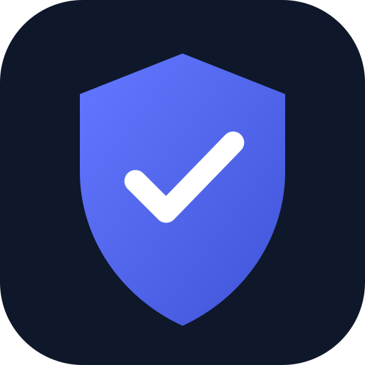

<div align="center">
  

  # DisRoute

  **Discord-only proxy routing for Windows — without sending the rest of the system through a VPN.**

  [](https://github.com/AlirezaZexter/disroute/actions/workflows/ci.yml)
  [](https://github.com/AlirezaZexter/disroute/releases)
  [](https://github.com/AlirezaZexter/disroute/releases)
  [](LICENSE)

  [Download](https://github.com/AlirezaZexter/disroute/releases) · [راهنمای فارسی](docs/START-HERE-FA.txt) · [Troubleshooting](docs/TROUBLESHOOTING.md) · [Contributing](CONTRIBUTING.md)
</div>

> [!IMPORTANT]
> DisRoute is a preview. The updater verifies release signatures, but the Windows installer is not yet Authenticode-signed. This is not a privacy, anonymity, or leak-prevention product.

## Why DisRoute?

Some networks cannot reach Discord reliably, while routing the whole computer through a VPN adds latency to games, browsers, and downloads. DisRoute targets the Discord desktop processes only and keeps unrelated applications on the normal network path.

- Per-process TCP and UDP routing for Discord Stable, PTB, and Canary
- VLESS, VMess, Trojan, and Shadowsocks share links
- Reality, TLS, TCP, WebSocket, HTTP, HTTPUpgrade, and gRPC transports where supported by the protocol
- XUDP and `packetaddr` selection from compatible VLESS share links
- Remote DNS recovery for Discord and dynamic voice hosts
- Windows-protected profile storage with explicit save and delete controls
- Persian RTL interface, tray lifecycle, keyboard access, and reduced-motion support
- Installer and portable Windows builds with pinned and SHA256-verified engines
- Signed in-app updates published through GitHub Releases
- Optional Community Quick Connect with configurable GitHub, subscription, local-file, and HTTPS sources
- Isolated sing-box health checks, Discord HTTPS latency ranking, UDP reporting, cached fallback, and bounded failover

The community manifest format and source model are documented in [Community sources](docs/COMMUNITY_SOURCES.md). The optional source registry includes public MIT-licensed subscriptions from Radikal and Au1rxx, plus a CDN mirror. Credentials are fetched at runtime, never bundled. Availability and latency depend on the local network and third-party endpoints.

## Quick start

1. Open [Releases](https://github.com/AlirezaZexter/disroute/releases) and download the Windows x64 setup file, not GitHub's source archive.
2. If Windows Packet Filter is not installed, download the portable fallback once and run its included ProxiFyre prerequisite installer.
3. Install DisRoute and start it as Administrator.
4. Paste your own VLESS, VMess, Trojan, or Shadowsocks share link, or choose **اتصال سریع رایگان**, acknowledge the third-party warning, and connect. Community mode refreshes, tests and ranks before connecting.
5. Future releases can be checked and installed from the **بررسی آپدیت** button inside the app.

The package includes a Persian text guide. WebView2, the Microsoft Visual C++ x64 runtime, and Windows Packet Filter are required.

## How it works


The Tauri/Rust controller owns the local engine lifecycle. ProxiFyre performs Windows per-process interception, the loopback bridge recovers validated Discord voice SNI without decrypting TLS, and sing-box carries the resulting TCP/UDP traffic through the selected proxy outbound.

## Voice and streaming

DisRoute does not cap upload bandwidth. Discord media uses UDP when available, and the UDP relay bypasses the TCP/SNI inspection path inside DisRoute. Actual stream quality still depends on:

- the proxy server's upstream capacity, distance, packet loss, and UDP support;
- whether the selected protocol and server support UDP (including XUDP or `packetaddr` for VLESS/VMess);
- TCP head-of-line blocking when UDP is encapsulated through a TCP-based transport;
- other applications competing for the same physical upload connection.

If calls connect but streams stall or pixelate, read [Voice and streaming troubleshooting](docs/TROUBLESHOOTING.md#voice-and-streaming). A successful HTTPS probe does not prove media quality.

## Supported links

DisRoute accepts the share-link formats below and validates required credentials, server, port, security mode, transport, and certificate settings before startup. Certificate verification cannot be disabled through the UI. Existing profiles saved by version 0.2.x are migrated automatically.

| Link | Supported values |
| --- | --- |
| VLESS | `vless://` with TLS/Reality, Vision, and UDP packet encoding |
| VMess | Base64 JSON `vmess://` links, including TLS and common transports |
| Trojan | `trojan://` links with TLS/Reality and common transports |
| Shadowsocks | SIP002 `ss://` links without external plugins |
| Transport | `tcp` / `raw`, `ws`, `http` / `h2`, `httpupgrade`, `grpc` |

Unknown transport, flow, security, and packet-encoding values fail closed with a readable error.

## Security boundaries

- Generated process rules match Discord executables and Discord's own updater path; games and browsers are not added.
- Saved profiles use Windows DPAPI and are bound to the current Windows account.
- The active sing-box configuration is temporarily written under the app's local AppData runtime directory and removed during normal shutdown.
- The updater validates every downloaded update with the embedded public key. The installer itself is not yet Authenticode-signed, so Windows SmartScreen can still warn.
- A local Administrator or malware running as the same user can still access runtime state and traffic.
- Routing separation cannot reserve bandwidth or prevent unrelated apps from saturating the connection.

See [SECURITY.md](SECURITY.md) for reporting guidance and [VOICE_ROUTING.md](VOICE_ROUTING.md) for the voice-host recovery design.

## Development

Requirements: Node.js 24+, Rust MSVC, Microsoft C++ Build Tools, and WebView2.

```powershell
npm ci
npm run check
npm run tauri dev
```

Build the production executable with Tauri's custom protocol enabled:

```powershell
npm run build:portable
```

Prepare the checksum-pinned engine resources and build the installer with updater artifacts:

```powershell
$env:TAURI_SIGNING_PRIVATE_KEY="$env:USERPROFILE\.tauri\disroute.key"
npm run build:installer
```

Do not substitute a plain `cargo build --release`; that leaves the Tauri development URL in the executable. Engine payloads are intentionally not committed. See [the release checklist](docs/RELEASING.md) for packaging and verification.

## Repository guide

| Path | Purpose |
| --- | --- |
| `src/` | React/TypeScript desktop interface |
| `src-tauri/src/` | Rust controller, profile protection, routing configuration, and voice bridge |
| `scripts/` | Reproducible packaging and dependency verification |
| `.github/workflows/` | Windows CI and signed tagged releases |
| `docs/` | Setup, release, and troubleshooting documentation |

## Contributing

Issues and focused pull requests are welcome. Never attach a real proxy link, unredacted engine configuration, packet capture, or user log. Start with [CONTRIBUTING.md](CONTRIBUTING.md) and the available issue templates.

## License

DisRoute is licensed under [AGPL-3.0-or-later](LICENSE). Bundled third-party components retain their own licenses and notices.

<div align="center"><sub>Created by Zexter · Independent of Discord Inc.</sub></div>
